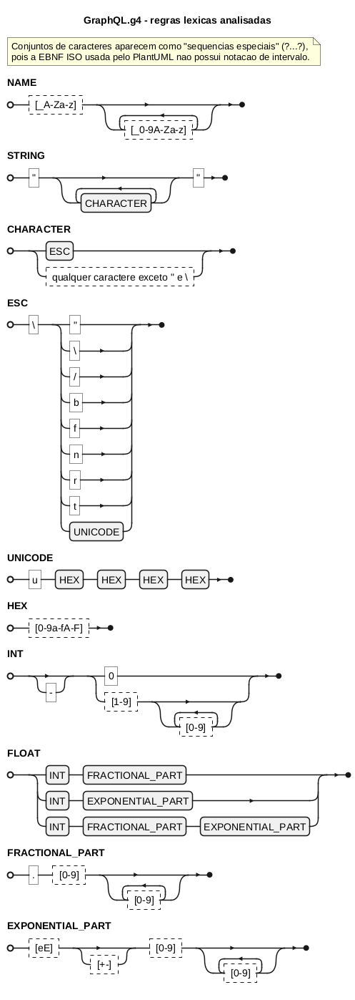
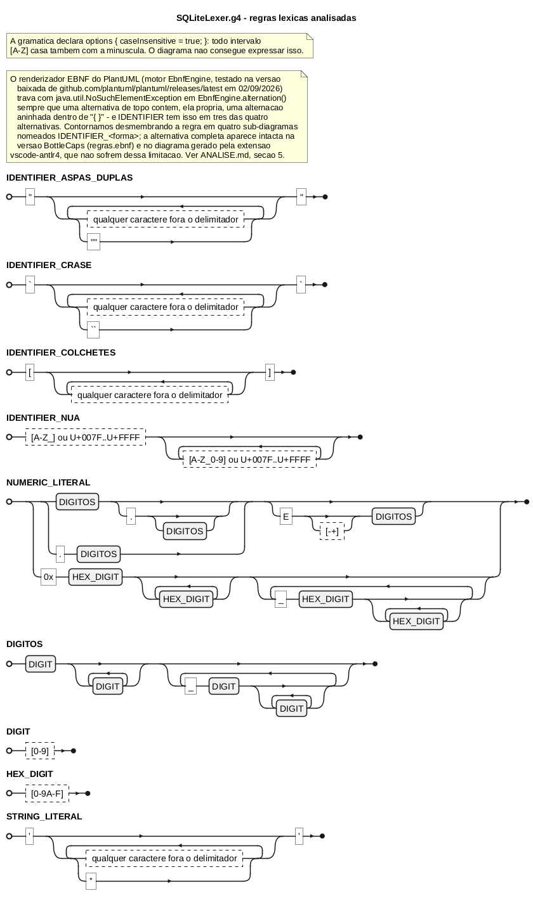

# TP1 - Analise comparativa: GraphQL.g4 x SQLiteLexer.g4

**PUCRS / Escola Politecnica - Linguagens de Programacao - 2026/II**
Arthur Mello Pimentel, Eduardo Alcaria Lopes, Ethan Soares S. da Rosa

Todos os resultados citados neste documento foram produzidos por `./run.sh` com
ANTLR 4.13.2 e estao em `out/saida-antlr4.txt` (saida bruta) e
`out/tabela-tokens.md` (tabela consolidada).

---

## 1. Os dois analisadores

| | GraphQL | SQLite |
|---|---|---|
| Arquivo | `graphql/GraphQL.g4` | `sql/sqlite/SQLiteLexer.g4` |
| Tipo | gramatica combinada (parser + lexer) | `lexer grammar` puro |
| Linhas | 570 (regras lexicas a partir da linha 445) | 245 |
| Autoria | grammars-v4, baseada na spec GraphQL Oct/2021 | Bart Kiers / Martin Mirchev (MIT) |
| `options` | nenhuma | `caseInsensitive = true` |
| Tokens declarados | 12 (+ 8 `fragment`) | ~200 (a maioria palavras-reservadas) |
| Catch-all de erro | **nao possui** | `UNEXPECTED_CHAR : .` |

A escolha do par e proposital: as duas gramaticas resolvem as **mesmas tres
categorias lexicas** (identificador, numero, texto) com estrategias opostas, o
que torna a comparacao concreta em vez de superficial.

Uma diferenca estrutural vale registrar desde ja: o GraphQL e uma gramatica
combinada, entao o ANTLR gera `GraphQLLexer.java` **e** `GraphQLParser.java`; o
SQLite e declarado com `lexer grammar`, gerando somente `SQLiteLexer.java`. Como
o enunciado restringe a analise as regras lexicas, no GraphQL trabalhamos apenas
com a metade do arquivo que comeca no comentario `//Start lexer` (linha 444).

---

## 2. Regra 1 - Identificador: `NAME` x `IDENTIFIER`

```antlr
// GraphQL.g4:445
NAME : [_A-Za-z] [_0-9A-Za-z]* ;
```

```antlr
// SQLiteLexer.g4:216
IDENTIFIER:
    '"' (~'"' | '""')* '"'
    | '`' (~'`' | '``')* '`'
    | '[' ~']'* ']'
    | [A-Z_\u007F-\uFFFF] [A-Z_0-9\u007F-\uFFFF]*
;
```

### Semelhancas

Ambas seguem o padrao classico "primeiro caractere restrito, demais caracteres
ampliados": nenhuma das duas aceita digito na primeira posicao, e as duas
admitem `_` tanto no inicio quanto no meio. Ambas sao regras de token
(maiuscula), nao `fragment`, e portanto produzem tokens visiveis ao parser.

### Diferencas

1. **Cardinalidade de alternativas.** O GraphQL tem uma unica forma. O SQLite
   tem quatro: tres delimitadas (`"..."`, `` `...` ``, `[...]`) e uma nua. As
   formas delimitadas existem para permitir identificadores que colidem com
   palavras-reservadas ou contem espacos - necessidade que o GraphQL
   simplesmente nao tem, porque nao possui ~180 palavras-reservadas.
2. **Escape por duplicacao.** Nas formas com `"` e `` ` ``, o SQLite permite
   `""` e ` `` ` como forma de embutir o proprio delimitador. A forma `[...]`
   nao tem escape algum (`'[' ~']'* ']'`), assimetria herdada do T-SQL.
3. **Alfabeto.** GraphQL e ASCII estrito. O SQLite inclui
   `\u007F-\uFFFF`, ou seja, aceita acentos e ideogramas sem delimitador.
4. **Sensibilidade a caixa.** `[A-Z_...]` no SQLite parece aceitar so
   maiusculas, mas `options { caseInsensitive = true; }` faz o ANTLR expandir
   todo intervalo de letras para as duas caixas. O GraphQL faz isso na mao com
   `[_A-Za-z]`. Uma leitura ingenua do SQLiteLexer.g4 - sem notar o bloco
   `options` - conclui o oposto do comportamento real.
5. **Conflito com palavras-reservadas.** No SQLite, `IDENTIFIER` e declarada
   *depois* das ~180 keywords. Como o ANTLR desempata tokens de mesmo
   comprimento pela ordem de declaracao, `SELECT` vira `SELECT_` e nao
   `IDENTIFIER`. No GraphQL nao existe esse problema: `query`, `mutation`,
   `fragment` etc. sao literais escritos dentro das regras do **parser**, nunca
   tokens lexicos separados. Consequencia pratica: em GraphQL, um campo chamado
   `query` e um `NAME` perfeitamente valido; em SQL, uma coluna chamada `select`
   exige delimitador. Um unico teste demonstra as duas coisas ao mesmo tempo
   (prioridade por ordem **e** `caseInsensitive`):

   ```
   $ java -cp ... DumpTokens SQLite <<< 'select'
   TOKENS   : 1
     SELECT_            'select'
   ```

### Resultados no ANTLR4

| Entrada | Lexer | Tokens | Erros |
|---|---|---|---|
| `userProfile_2024` | GraphQL | `NAME` | 0 |
| `_internalFieldName` | GraphQL | `NAME` | 0 |
| `2024userProfile` | GraphQL | `INT('2024')` `NAME('userProfile')` | 0 |
| `user-profile-name` | GraphQL | `NAME('user')` `NAME('rofile')` `NAME('ame')` | 2 |
| `"minha coluna"` | SQLite | `IDENTIFIER` | 0 |
| `[Order Details]` | SQLite | `IDENTIFIER` | 0 |
| `'minha coluna'` | SQLite | `STRING_LITERAL` | 0 |
| `2024_vendas` | SQLite | `NUMERIC_LITERAL('2024')` `IDENTIFIER('_vendas')` | 0 |

Tres pontos merecem comentario.

**O "rejeitado" quase nunca e um erro.** `2024userProfile` e `2024_vendas` nao
produzem erro nenhum: o lexer simplesmente quebra a entrada em dois tokens. Isso
e consequencia direta do algoritmo *maximal munch* do ANTLR - ele consome o
maior prefixo que alguma regra reconhece e recomeca. A rejeicao so e visivel na
**forma** do fluxo de tokens, nao em uma mensagem de erro. E um parser que
esperasse um identificador nessa posicao e que reportaria o problema.

**Erro lexico descarta caracteres.** Em `user-profile-name` o ANTLR reporta:

```
line 1:4 token recognition error at: '-p'
line 1:12 token recognition error at: '-n'
```

e os tokens seguintes sao `rofile` e `ame`, nao `profile` e `name`. O motivo
esta em `Lexer.nextToken()`: ao falhar, a mensagem cobre o intervalo
`[inicioDoToken, posicaoAtualDaSimulacao]` - aqui `-p`, porque a simulacao
avancou sobre o `p` tentando casar `INT` (`NEGATIVE_SIGN? ...`) - e em seguida
`recover()` consome exatamente um caractere, o ultimo do intervalo reportado.
Resultado: `-` e `p` sao ambos perdidos. Um erro lexico, portanto, nao afeta so
a posicao onde ocorre: ele *desloca* o restante da tokenizacao.

**Aspas trocam de significado entre as duas linguagens.** `"minha coluna"` e
`IDENTIFIER` em SQLite e `STRING` em GraphQL; `'minha coluna'` e
`STRING_LITERAL` em SQLite e nem sequer e reconhecivel em GraphQL. O mesmo
caractere delimitador leva a categorias lexicas opostas - o caso mais didatico
de todo o trabalho.

---

## 3. Regra 2 - Numero: `INT`/`FLOAT` x `NUMERIC_LITERAL`

```antlr
// GraphQL.g4:507
FLOAT
    : INT FRACTIONAL_PART
    | INT EXPONENTIAL_PART
    | INT FRACTIONAL_PART EXPONENTIAL_PART
    ;

INT
    : NEGATIVE_SIGN? '0'
    | NEGATIVE_SIGN? NONZERO_DIGIT DIGIT*
    ;

fragment FRACTIONAL_PART   : '.' DIGIT+ ;
fragment EXPONENTIAL_PART  : EXPONENT_INDICATOR SIGN? DIGIT+ ;
fragment EXPONENT_INDICATOR: [eE] ;
fragment SIGN              : [+-] ;
fragment NEGATIVE_SIGN     : '-' ;
fragment NONZERO_DIGIT     : [1-9] ;
fragment DIGIT             : [0-9] ;
```

```antlr
// SQLiteLexer.g4:223
NUMERIC_LITERAL:
    (DIGIT+ ('_' DIGIT+)* ('.' (DIGIT+ ('_' DIGIT+)*)?)? | '.' DIGIT+ ('_' DIGIT+)*) (
        'E' [-+]? DIGIT+ ('_' DIGIT+)*
    )?
    | '0x' HEX_DIGIT+ ('_' HEX_DIGIT+)*
;

fragment HEX_DIGIT : [0-9A-F] ;
```

### Semelhancas

As duas reconhecem parte inteira, parte fracionaria e expoente opcional, e as
duas tratam o expoente como sufixo opcional aplicado ao numero ja formado.

### Diferencas

| Aspecto | GraphQL | SQLite |
|---|---|---|
| Sinal | **dentro** do token (`NEGATIVE_SIGN?`) | fora: `-` e o token `MINUS` |
| Sinal positivo | nao aceito (`+5` nao e INT) | nao aceito (`PLUS` separado) |
| Zeros a esquerda | proibidos (`NONZERO_DIGIT`) | permitidos |
| Separador de grupo | nenhum | `_` entre grupos de digitos |
| Hexadecimal | ausente | `0x` + digitos hex (com `_`) |
| Ponto inicial (`.5`) | nao (exige `INT` antes) | sim (segunda alternativa) |
| Ponto final (`5.`) | nao (`FRACTIONAL_PART` exige `DIGIT+`) | sim (`'.' (...)?`) |
| Int e float | **dois tokens** distintos | **um so** token |
| Estilo | 8 `fragment` nomeados | tudo inline em uma regra |

A diferenca de **sinal** e a mais consequente. Em GraphQL, `-3.14e+08` e um
unico token `FLOAT`; em SQLite, `-42000` sao dois tokens (`MINUS`,
`NUMERIC_LITERAL`). Isso significa que, em GraphQL, a expressao `10-5` e lexada
como `INT('10')` seguido de `INT('-5')` - verificado:

```
$ java -cp ... DumpTokens GraphQL <<< '10-5'
TOKENS   : 2
  INT                '10'
  INT                '-5'
```

**o operador de subtracao desaparece no lexer**. Nao e um bug da gramatica - GraphQL e uma linguagem de
consulta sem aritmetica, entao `-` so pode ser sinal. Mas ilustra bem que a
fronteira entre lexer e parser e uma decisao de projeto, nao uma verdade
objetiva: o SQLite precisa que `-` chegue ao parser como operador, e por isso o
deixa fora do literal.

A diferenca de **estilo** (fragments nomeados x regex inline) nao muda o que e
reconhecido, mas muda drasticamente a legibilidade e, como veremos na secao 5,
o diagrama de ferrovia resultante.

### Resultados no ANTLR4

| Entrada | Lexer | Tokens | Erros |
|---|---|---|---|
| `-3.14e+08` | GraphQL | `FLOAT` | 0 |
| `10500.75` | GraphQL | `FLOAT` | 0 |
| `10_000.00` | GraphQL | `INT('10')` `NAME('_000')` `INT('0')` | 1 |
| `007.50` | GraphQL | `INT('0')` `INT('0')` `FLOAT('7.50')` | 0 |
| `10_000.00` | SQLite | `NUMERIC_LITERAL` | 0 |
| `0xDEAD_BEEF` | SQLite | `NUMERIC_LITERAL` | 0 |
| `-42000` | SQLite | `MINUS` `NUMERIC_LITERAL('42000')` | 0 |
| `10,000.00` | SQLite | `NUMERIC_LITERAL('10')` `COMMA` `NUMERIC_LITERAL('000.00')` | 0 |

O caso `10_000.00` e o exemplo sugerido pelo proprio enunciado e separa os dois
lexers de forma limpa: **um unico token** no SQLite, **tres tokens mais um
erro** no GraphQL:

```
INT  '10'
NAME '_000'
line 1:6 token recognition error at: '.0'
INT  '0'
```

A leitura passo a passo e instrutiva. O ANTLR consome `10` como `INT` (nao pode
continuar, `_` nao e digito); depois `_000` casa `NAME`, porque `_` inicia
identificador em GraphQL; sobra `.00`, e `.` nao pertence a nenhum token -
`PUNCTUATOR` so tem `'...'`, nao o ponto isolado. O erro reporta `.0` (a
simulacao avancou um caractere procurando `...`), `recover()` descarta os dois,
e resta `0`, um `INT`. Ou seja: um separador de milhar inofensivo produz um
fluxo de tokens completamente irreconhecivel para o parser.

`007.50` mostra a proibicao de zeros a esquerda de forma indireta e elegante:
**nao ha erro nenhum**, mas o resultado sao tres tokens
(`INT('0')`, `INT('0')`, `FLOAT('7.50')`) em vez de um. A regra `INT` so aceita
`0` sozinho ou um numero iniciado por `[1-9]`, entao cada zero extra vira um
token proprio. No SQLite, `000.00` e um `NUMERIC_LITERAL` unico e valido.

`10,000.00` confirma que a virgula tambem nao funciona como separador de grupo
no SQLite - mas, diferente do GraphQL, sem erro algum: `,` e um token legitimo
(`COMMA`), entao a entrada vira tres tokens perfeitamente validos e o problema
so aparece no parser.

---

## 4. Regra 3 - Texto: `STRING` x `STRING_LITERAL`

```antlr
// GraphQL.g4:449
fragment CHARACTER : (ESC | ~ ["\\]) ;
fragment ESC       : '\\' (["\\/bfnrt] | UNICODE) ;
fragment UNICODE   : 'u' HEX HEX HEX HEX ;
fragment HEX       : [0-9a-fA-F] ;

STRING       : '"' CHARACTER* '"' ;
BLOCK_STRING : '"""' .*? '"""' ;
```

```antlr
// SQLiteLexer.g4:232
STRING_LITERAL : '\'' ( ~'\'' | '\'\'')* '\'' ;
```

### Semelhancas

Estrutura identica no esqueleto: delimitador, repeticao de "conteudo",
delimitador. As duas precisam de um mecanismo para embutir o proprio delimitador
no texto, e as duas resolvem isso - por caminhos opostos.

### Diferencas

1. **Delimitador.** `"` no GraphQL, `'` no SQLite. Como visto na secao 2, cada
   um usa o delimitador do outro para identificadores, o que torna a troca de
   aspas um erro de categoria, nao de sintaxe.
2. **Mecanismo de escape.** GraphQL usa **barra invertida** com um conjunto
   fechado de escapes (`" \ / b f n r t` e `\uXXXX`). SQLite usa **duplicacao
   do delimitador** (`''`), estrategia herdada do SQL padrao. A consequencia
   pratica e grande: no SQLite a barra invertida nao tem significado especial,
   entao `'c:\pasta\arquivo'` e uma string valida; no GraphQL a mesma ideia
   escrita como `"c:\pasta\arquivo"` falha, porque `\p` nao esta no conjunto de
   escapes.
3. **Escape unicode.** So o GraphQL tem `\uXXXX`, via os fragments `UNICODE` e
   `HEX`. O SQLite nao precisa: aceita o caractere direto no texto.
4. **Conjunto complementar.** GraphQL exclui **dois** caracteres do conteudo
   livre (`~["\\]`), porque tanto a aspa quanto a barra sao significativas.
   SQLite exclui **um** (`~'\''`).
5. **String multilinha.** GraphQL tem `BLOCK_STRING : '"""' .*? '"""'`, usando
   o operador nao-guloso `.*?`. Nao ha equivalente no SQLite.
6. **Sem definicao explicita de conteudo no SQLite.** `~'\''` casa inclusive
   `\n`, entao uma string SQLite pode atravessar linhas sem nenhuma sintaxe
   especial. No GraphQL, `~["\\]` tambem casa `\n` - a spec proibe, mas *esta
   gramatica* nao.

### Resultados no ANTLR4

| Entrada | Lexer | Tokens | Erros |
|---|---|---|---|
| `"Caf\u00e9 com leite"` | GraphQL | `STRING` | 0 |
| `"linha1\nlinha2"` | GraphQL | `STRING` | 0 |
| `"c:\pasta\arquivo"` | GraphQL | `NAME('asta')` `NAME('arquivo')` | 3 |
| `"sem fechamento` | GraphQL | *(nenhum)* | 1 |
| `'O''Brien e Cia'` | SQLite | `STRING_LITERAL` | 0 |
| `'c:\pasta\arquivo'` | SQLite | `STRING_LITERAL` | 0 |
| `"texto simples"` | SQLite | `IDENTIFIER` | 0 |
| `'sem fechamento` | SQLite | `UNEXPECTED_CHAR` `IDENTIFIER` `SPACES` `IDENTIFIER` | 0 |

O caso `"c:\pasta\arquivo"` e o mais dramatico:

```
line 1:0  token recognition error at: '"c:\p'
line 1:9  token recognition error at: '\'
line 1:17 token recognition error at: '"'
NAME 'asta'
NAME 'arquivo'
```

Um unico escape invalido derruba a string inteira, e a recuperacao de erro
propaga o estrago por toda a linha: sobram dois `NAME` que nao existiam na
intencao do autor (`asta` perdeu o `p`, pelo mesmo mecanismo de descarte
descrito na secao 2). A aspa de fechamento vira um terceiro erro isolado.

O par `"sem fechamento` x `'sem fechamento` e o contraste central do trabalho:

- **GraphQL**: zero tokens, um erro cobrindo a linha inteira. Sem `STRING`
  fechada e sem catch-all, nao ha o que emitir.
- **SQLite**: zero erros e quatro tokens
  (`UNEXPECTED_CHAR('\'')`, `IDENTIFIER('sem')`, `SPACES(' ')` no canal oculto,
  `IDENTIFIER('fechamento')`).

O SQLite **nunca falha no lexer**, por causa da ultima regra do arquivo:

```antlr
UNEXPECTED_CHAR: .;
```

Qualquer caractere que nao case nenhuma regra anterior vira um token
`UNEXPECTED_CHAR`. O erro deixa de ser lexico e passa a ser sintatico - o parser
e que vai reclamar. E uma decisao de projeto com um custo e um beneficio claros:
mensagens de erro melhores (o parser sabe o contexto, o lexer nao) em troca de
deteccao mais tardia.

---

## 5. Diagramas de sintaxe

Os fontes estao em `diagramas/`:

- `regras.ebnf` - todas as seis regras em EBNF do W3C, para o
  [BottleCaps RR](https://www.bottlecaps.de/rr/ui);
- `graphql.puml` e `sqlite.puml` - EBNF ISO para o
  [PlantUML](https://plantuml.com/ebnf), renderizadas localmente com
  `tools/plantuml.jar` (comando em `README.md`) em
  `diagramas/img/graphql.png` e `diagramas/img/sqlite.png`;
- a extensao [vscode-antlr4](https://marketplace.visualstudio.com/items?itemName=mike-lischke.vscode-antlr4)
  gera os diagramas direto de `grammars/*.g4`, sem arquivo intermediario.





*(inserir tambem aqui as capturas de tela do BottleCaps e da extensao
vscode-antlr4 para comparacao lado a lado com o PNG do PlantUML acima)*

### Comparacao entre as tres ferramentas

| | vscode-antlr4 | BottleCaps RR | PlantUML |
|---|---|---|---|
| Entrada | `.g4` original | EBNF W3C manual | EBNF ISO manual |
| Risco de divergir da gramatica | nenhum | alto (traducao manual) | alto |
| Expande `fragment` | nao (mostra a caixa e permite navegar) | so se o fragment for redeclarado | idem |
| Intervalos de caracteres | mostra `[_A-Za-z]` como caixa unica | idem | nao suporta; exigiu "sequencia especial" `?...?` |
| Versionavel em texto | nao (gera SVG sob demanda) | sim | sim |
| Robustez do motor de render | nao testado a fundo | sem falhas observadas | **bug reproduzivel** (ver abaixo) |

O ponto pratico: as duas ferramentas manuais exigem **transcrever** a regra, e
transcrever e errar. Ao traduzir `IDENTIFIER` para o PlantUML tivemos que
substituir `[A-Z_\u007F-\uFFFF]` por uma sequencia especial descritiva, porque a
EBNF ISO nao tem notacao de intervalo. A extensao do VS Code nao tem esse
problema, mas em compensacao nao produz um artefato de texto que possa ser
revisado em um pull request.

### Achado extra: bug no motor EBNF do PlantUML

Ao renderizar `IDENTIFIER` (a regra com quatro alternativas da secao 2), o
PlantUML falhava de forma reproduzivel com
`java.util.NoSuchElementException` em `EbnfEngine.alternation()`, mesmo com a
sintaxe `.puml` correta. Isolamos a causa por bissecao manual: o motor quebra
sempre que **uma alternativa de topo (`|`) contem, ela propria, uma alternacao
aninhada dentro de `{ }`** - exatamente a forma de tres das quatro alternativas
de `IDENTIFIER` (por exemplo, `'"', { A | '""' }, '"'`). Regras com apenas uma
alternativa aninhada, ou com varias alternativas de topo sem aninhamento
interno, renderizam normalmente - so a combinacao das duas falha.

Contornamos dividindo `IDENTIFIER` em quatro sub-diagramas
(`IDENTIFIER_ASPAS_DUPLAS`, `IDENTIFIER_CRASE`, `IDENTIFIER_COLCHETES`,
`IDENTIFIER_NUA`), visiveis em `diagramas/img/sqlite.png`. A regra unificada,
sem esse desmembramento, aparece corretamente no BottleCaps (a partir de
`regras.ebnf`) e na extensao vscode-antlr4 - nenhuma das duas usa o mesmo
motor de renderizacao do PlantUML. O episodio reforca o ponto da tabela acima:
ferramentas que exigem uma traducao manual da gramatica (EBNF escrita a mao)
carregam um segundo tipo de risco, alem do erro de transcricao - o proprio
renderizador pode ter limitacoes que so aparecem em regras com determinada
forma estrutural.

### Como as diferencas de escrita aparecem no desenho

O contraste mais visivel e entre `FLOAT`/`INT` e `NUMERIC_LITERAL`, e ele nao
tem nada a ver com o que as regras reconhecem:

- **GraphQL** decompoe o numero em oito `fragment` curtos. Cada diagrama cabe em
  uma linha; `FLOAT` vira tres trilhos paralelos referenciando caixas
  (`INT`, `FRACTIONAL_PART`, `EXPONENTIAL_PART`). Para entender o formato
  completo e preciso abrir quatro diagramas. E navegavel, mas fragmentado.
- **SQLite** escreve tudo inline. `NUMERIC_LITERAL` gera um unico diagrama largo
  com lacos aninhados a tres niveis (`DIGIT+`, dentro de `('_' DIGIT+)*`, dentro
  do grupo opcional da fracao). Tudo esta a vista de uma vez, mas o desenho
  exige rastrear os lacos com o dedo.

Ou seja: **o diagrama de ferrovia expoe o estilo de escrita da gramatica, nao
so a linguagem reconhecida**. Duas regras equivalentes escritas em estilos
diferentes produzem diagramas com legibilidade muito diferente.

Ha tambem duas coisas que **nenhum** diagrama consegue mostrar, e isso e uma
limitacao importante da tecnica:

1. `options { caseInsensitive = true; }` - o diagrama de `IDENTIFIER` desenha
   `[A-Z_...]` e sugere que minusculas sao rejeitadas. Sao aceitas.
2. A **ordem de declaracao** das regras. O diagrama de `IDENTIFIER` nao informa
   que ~180 keywords tem prioridade sobre ela; o de `STRING` do GraphQL nao
   informa que `ID` (secao 6) e inalcancavel. Como a resolucao de ambiguidade do
   ANTLR depende de *maior casamento* e, no empate, da *ordem no arquivo*, o
   diagrama de uma regra isolada e sempre uma verdade parcial.

---

## 6. Achados adicionais na gramatica do GraphQL

Estes pontos surgiram da leitura linha a linha e foram confirmados
empiricamente. Nenhum deles gera aviso do ANTLR 4.13.2 durante a geracao.

### 6.1 O token `ID` e inalcancavel

```antlr
// GraphQL.g4:453
STRING : '"' CHARACTER* '"' ;
...
// GraphQL.g4:461
ID : STRING ;
```

`ID` reconhece exatamente a mesma linguagem de `STRING` e e declarada depois.
Como o ANTLR desempata casamentos de mesmo comprimento pela ordem de declaracao,
`STRING` sempre vence. `ID` existe no vocabulario gerado
(`GraphQLLexer.java`, vetor de nomes simbolicos) mas **nunca e emitido**.
Verificacao:

```
$ java -cp ... DumpTokens GraphQL <<< '"abc12"'
TOKENS   : 1
  STRING             '"abc12"'
```

### 6.2 O `fragment EXP` e codigo morto

```antlr
// GraphQL.g4:537
fragment EXP : [Ee] [+\-]? INT ;
```

Nenhuma regra referencia `EXP`; o expoente real e feito por
`EXPONENTIAL_PART`. Note ainda que `EXP` usaria `INT`, que aceita sinal proprio
- `1e--5` seria valido por esse caminho, se ele fosse usado.

### 6.3 A regra `UTF8_BOM` esta incorreta

```antlr
// GraphQL.g4:561
UTF8_BOM : '\uEFBBBF' ;
```

O ANTLR interpreta `\u` como escape de **exatamente quatro** digitos
hexadecimais. Portanto o literal e lido como o caractere `U+EFBB` seguido das
letras `B` e `F` - nao como o BOM UTF-8. Confirmacao experimental:

| Entrada | Resultado |
|---|---|
| `U+EFBB` + `"BF"` + `abc12` | casa e e descartado; `NAME('abc12')`, 0 erros |
| `U+EFBB` + `abc12` (sem `BF`) | **erro**: `token recognition error at: 'a'` |
| BOM real (`U+FEFF`) + `abc12` | casa por `UTF16_BOM`, nao por `UTF8_BOM` |

A regra e inofensiva na pratica - um BOM UTF-8 lido por um `CharStream` do ANTLR
ja chega decodificado como `U+FEFF` e e capturado por `UTF16_BOM` - mas nao faz
o que o nome promete. Ela so casa quando a entrada contem, literalmente, o
caractere `U+EFBB` seguido das letras `BF`, algo que nunca ocorre em um arquivo
real. Manter apenas `UTF16_BOM` teria o mesmo efeito pratico e nao induziria o
leitor ao erro.

### 6.4 Nao ha catch-all

Ja discutido na secao 4. Vale registrar como decisao consciente de projeto e nao
como esquecimento: gramaticas de linguagens de consulta pequenas costumam
preferir falhar cedo.

---

## 7. Sintese

| Dimensao | GraphQL | SQLite |
|---|---|---|
| Filosofia | minimalista; poucos tokens, spec como fonte | pragmatico; muitos tokens, compatibilidade |
| Escapes | barra invertida, conjunto fechado, `\uXXXX` | duplicacao do delimitador |
| Numeros | dois tokens, sinal embutido, sem acucar | um token, sinal fora, `_` e `0x` |
| Identificadores | uma forma, ASCII | quatro formas, unicode, case-insensitive |
| Palavras-reservadas | literais no parser | ~180 tokens antes de `IDENTIFIER` |
| Erro lexico | possivel, destrutivo (descarta caracteres) | impossivel (`UNEXPECTED_CHAR`) |
| Manutencao | `fragment` nomeados, muito legivel | regex inline, denso |
| Qualidade | 3 defeitos encontrados (`ID`, `EXP`, `UTF8_BOM`) | nenhum defeito encontrado |

O aprendizado principal do grupo: **"a entrada e rejeitada" quase nunca
significa "o ANTLR emite um erro"**. Em 12 casos projetados como rejeicoes, so
4 produziram `token recognition error` - todos no GraphQL. Nos outros 8 a
rejeicao se manifestou como uma *quebra diferente* do fluxo de tokens, silenciosa
no nivel lexico. Avaliar um lexer, portanto, exige olhar a sequencia de tokens
produzida, e nao apenas a presenca ou ausencia de mensagens de erro.

---

## 8. Metodologia

1. Leitura integral das duas gramaticas em `grammars/` (copias fieis dos
   arquivos do grammars-v4, sem nenhuma modificacao).
2. Selecao de tres categorias lexicas presentes nos dois lexers, para que a
   comparacao fosse par a par e nao anedotica.
3. Projeto de 24 casos de teste (3 regras x 4 casos x 2 lexers), documentados
   com justificativa em `inputs/casos.tsv`. As entradas seguem as orientacoes do
   enunciado: nenhuma palavra-reservada literal, minimo de cinco caracteres,
   e o caso `10_000.00` explicitamente sugerido.
4. Execucao automatizada via `run.sh`, com ANTLR 4.13.2 e OpenJDK 26. O driver
   `src/DumpTokens.java` instala um `BaseErrorListener` proprio para capturar as
   mensagens de erro do lexer de forma estruturada.
5. Verificacao empirica de cada afirmacao da secao 6 com entradas dedicadas.
6. Geracao dos diagramas pelas tres ferramentas indicadas no enunciado.

### Uso de ferramentas de IA generativa

Conforme exigido pelo enunciado, declaramos o uso de IA generativa
(Claude, Anthropic) nas seguintes etapas:

- leitura inicial e resumo das duas gramaticas;
- sugestao de casos de teste candidatos;
- redacao do driver `DumpTokens.java` e do script `run.sh`;
- primeira versao da redacao deste documento.

**Nao** foi usada IA para: a execucao dos casos (todos os resultados vem da
saida real do ANTLR 4.13.2, reproduzivel por `./run.sh`) nem para a verificacao
dos achados da secao 6, feita rodando entradas dedicadas. Todo o conteudo foi
revisado e e compreendido pelos tres integrantes, que respondem por ele.

### Fontes

1. Parr, T. *The Definitive ANTLR 4 Reference*, 2nd ed. Pragmatic Bookshelf, 2013.
   (cap. 5, "Designing Grammars"; cap. 15, "Lexical Analysis")
2. ANTLR 4 Documentation - Lexer Rules.
   <https://github.com/antlr/antlr4/blob/master/doc/lexer-rules.md>
3. ANTLR 4 Documentation - Grammar Options (`caseInsensitive`).
   <https://github.com/antlr/antlr4/blob/master/doc/case-insensitive-lexing.md>
4. grammars-v4 - `graphql/GraphQL.g4`.
   <https://github.com/antlr/grammars-v4/blob/master/graphql/GraphQL.g4>
5. grammars-v4 - `sql/sqlite/SQLiteLexer.g4`.
   <https://github.com/antlr/grammars-v4/blob/master/sql/sqlite/SQLiteLexer.g4>
6. GraphQL Specification, October 2021 - secoes *Names*, *Int Value*,
   *Float Value*, *String Value*. <https://spec.graphql.org/October2021/>
7. SQLite - *SQL As Understood By SQLite*: literais, palavras-reservadas e
   identificadores delimitados. <https://sqlite.org/lang_keywords.html>
